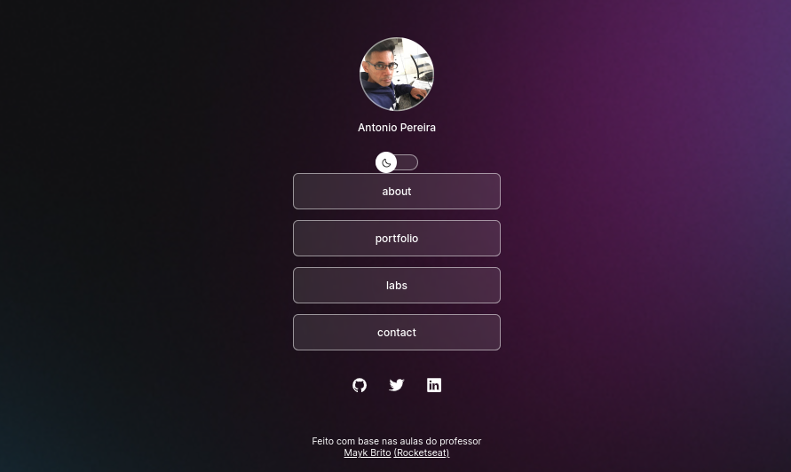
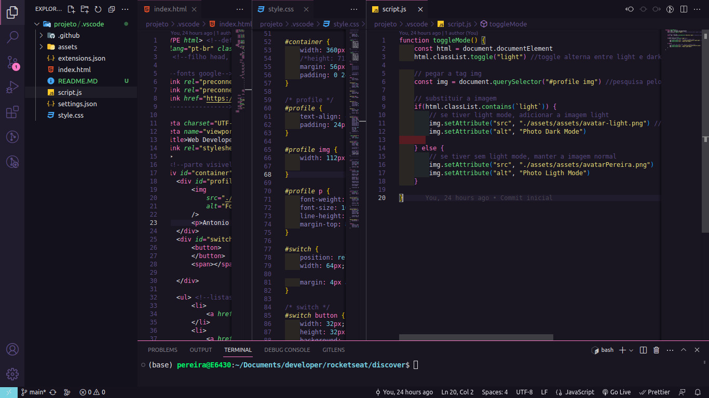

<h1 align="center"> Projeto : DevLinks </h1>

[<a href="https://www.rocketseat.com.br/discover" target="_blank">Discover</a>] é um Curso de Introdução à Tecnologia 
É um programa exclusivo e gratuito, promovido pela <a href="https://www.rocketseat.com.br/" target="_blank">Rocketseat</a> para ensino de tecnologias WEB.  
<a href="https://lp.rocketseat.com.br/devlinks/inscricao?utm_source=github&utm_medium=descricao&utm_campaign=capture-devlinks&utm_term=organic&utm_content=descricao-github-mayk-brito">Estude esse projeto em formato de vídeo clicando aqui.</a>

  <a href="#-tecnologias">Tecnologias</a>&nbsp;&nbsp;&nbsp;|&nbsp;&nbsp;&nbsp;
  <a href="#-projeto">Projeto</a>&nbsp;&nbsp;&nbsp;|&nbsp;&nbsp;&nbsp;
  <a href="#-layout">Layout</a>&nbsp;&nbsp;&nbsp;|&nbsp;&nbsp;&nbsp;
  <a href="#memo-licença">Licença</a>

  

 

  

## 🚀 Tecnologias

Esse projeto foi desenvolvido com as seguintes tecnologias:

  

> <a href="https://developer.mozilla.org/pt-BR/docs/Web/HTML">HTML</a> e <a href="https://developer.mozilla.org/en-US/docs/Web/CSS">CSS</a>

> <a href="https://developer.mozilla.org/pt-BR/docs/Web/JavaScript">JavaScript</a>

> <a href="https://git-scm.com">Git</a> e <a href="https://github.com/">Github</a>

> <a href="https://github.com/">Figma</a>

## 💻 Projeto

O DevLinks é um agregador de links para usar como cartão de visitas online.

- [Acesse o projeto finalizado, online](#)

## 🔖 Layout

Você pode visualizar o layout do projeto através [DESSE LINK](https://www.figma.com/community/file/1187422022288947321). É necessário ter conta no [Figma](https://figma.com) para acessá-lo.

## 📝 Licença

Esse projeto está sob a <a href="https://pt.wikipedia.org/wiki/Licen%C3%A7a_MIT">licença MIT</a>.

  

---

Feito com base nas aulas do professor <a href="https://maykbrito.dev/">Mayk Brito</a> (<a href="https://www.rocketseat.com.br/">Rocketseat</a>)
